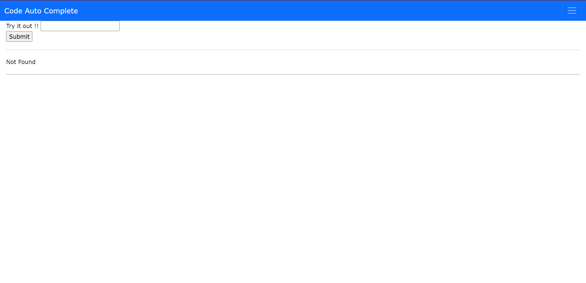
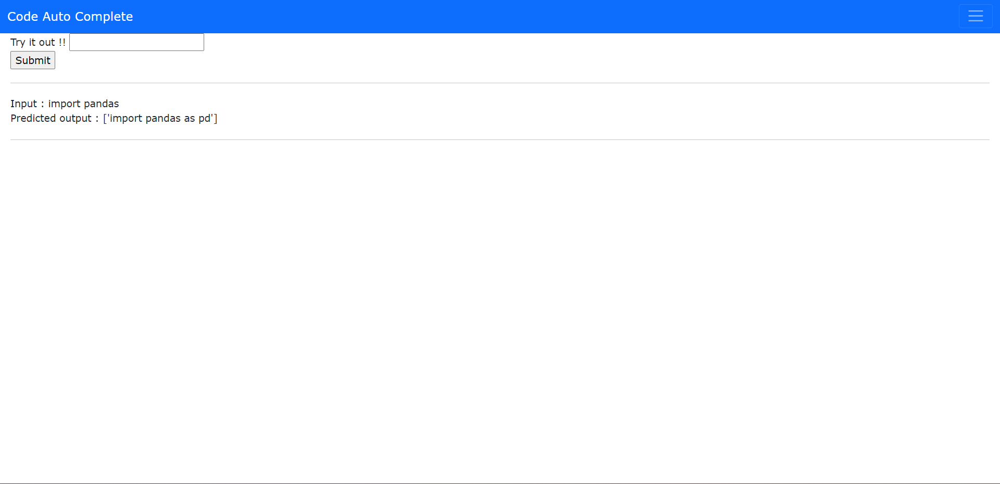

# Code Autocomplete

BI-LSTM Language Model for Autocode completion on codeparrot

## Requirement
* pip install -r requrement.txt

## Technologies Used
* Python 
* Spacy
* flask 

## Features 
Screenshot of my front page and the results for autocomplete

