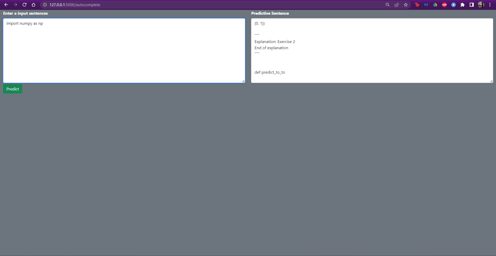

# Code Autocomplete with HuggingFace

Autocode Completion with HuggingFace

## Technologies Used
* Python 
* HuggingFace
* flask 

## Dataset
Wikitext-2 datset is a large language modeling dataset consisting of approximately 2 billion words of text from articles on Wikipedia. This dataset is included in HuggingFace library.

## Tokenizer
We use CodeSearchNet Tokenizer to preprocess source code for use in code search and retrieval systems.

## Web Deployment
Screenshot of my results for autocomplete

