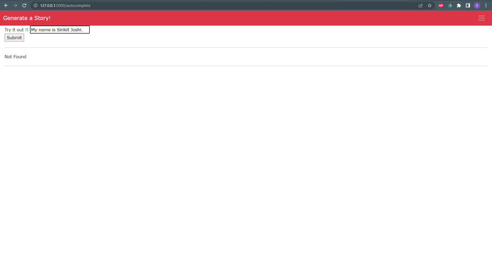
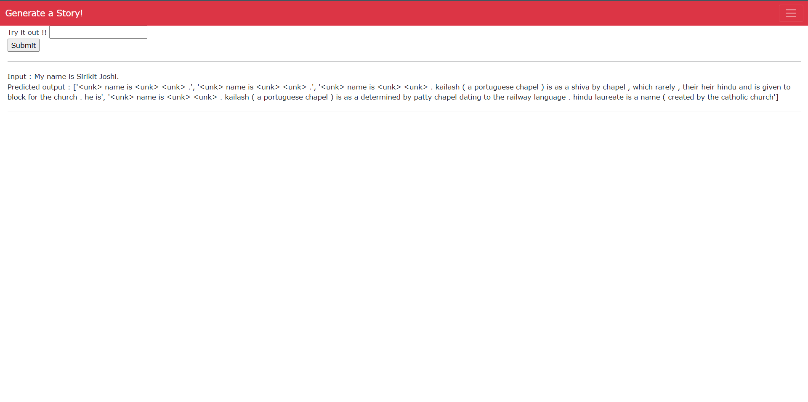

# Code Autocomplete with Transformer

Transformer for Autocode completion

## Technologies Used
* Python 
* Spacy
* flask 

## Dataset
Wikitext-2 datset is a large language modeling dataset consisting of approximately 2 billion words of text from articles on Wikipedia. This dataset is included in HuggingFace library.

## Tokenizer
We use 'basic_english' tokenizer to split sentences into a sequence of words based on spaces, tabs and line breaks in the data. It also handles punctuation like periods, commans and question marks.

## Web Deployment
Screenshot of my front page and the results for autocomplete

## Inspiration
I would like to thank Todsavad for inspiration for web page and Ayush for helping me deploy it.