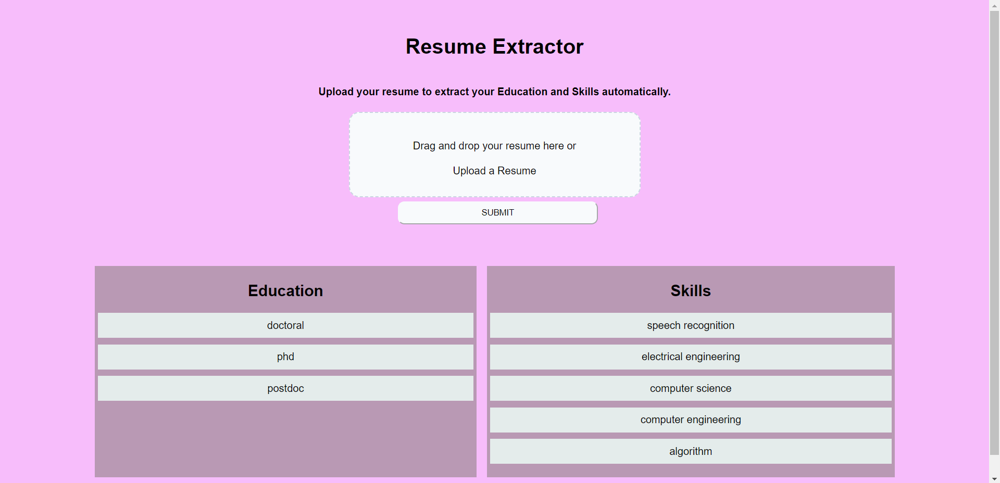

# PDF Resume Extractor

A web application that extracts information from PDF resumes and performs Named Entity Recognition to identify entities like names, organizations, and locations.

## Technologies Used

* Python
* FastAPI
* ReactJS
* Named Entity Recognition (NER)

## Features

- Upload a PDF resume and extract information like Education and Skills
- Perform NER on the extracted information to identify entities like education and skills
- Display the extracted information and entities in a user-friendly simple interface

## Getting Started

Follow these instructions to get the project up and running on your local machine for testing.

### Prerequisities

* Python 3.x
* Node.js and npm (Node Package Manager)

### Installation

1. Clone the repository

### `git clone https://github.com/<your-username>/pdf-resume-extractor.git`

2. Navigate to the project directory

### `cd pdf-resume-extractor`

3. Install the Python dependencies

### `pip install -r requirements.txt`

4. Navigate to the client directory

### `cd client`

5. Install the Node.js dependencies

### `npm install`

### Running the Application

1. Start the FastAPI server

### `python main.py`

2. Start the ReactJS client

### `npm start`

The application will be accessible at http://localhost:3000 in your web browser.

# Here is how the website works

The homepage looks like this.
You can either drag a resume in the box or upload a resume and submit. 

Then, at the bottom you get these results.

## Contributors
Thank you to Ayush and Sandhya for helping me in the backend and frontend of the website making. Thanks to Ati for the jsonl pipeline used in this project. Thanks to Chaky for this wonderful assignment.