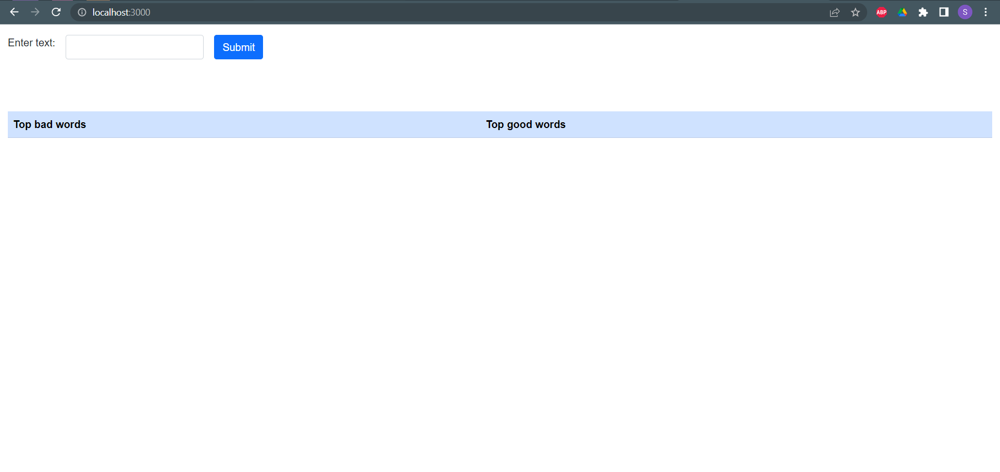
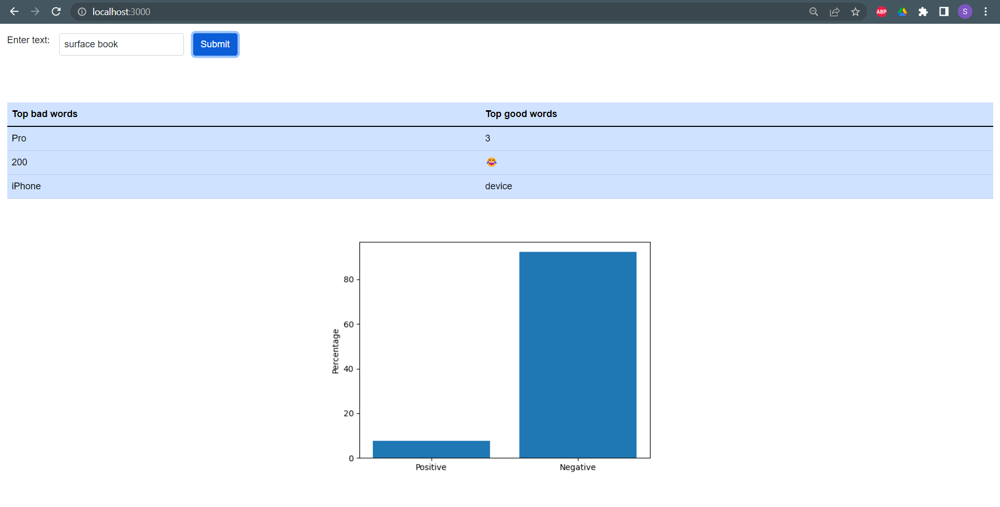

# Sentiment Analysis with Stanford Treebank

A web application that takes in user input and uses twitter data to output list of top good and bad words along with a graph showing distribution of positive and negative posts associated with the word.

## Technologies Used

* Python
* FastAPI
* ReactJS
* spaCy
* pytreebank
* twint

## Features

- Input a word into the given text box
- Use Twint to scrape twitter data associated with the input word
- Carry out Bi-LSTM sentiment classification on Stanford Sentiment Treebank
- Output top good and bad words
- Output graph showing distribution of positive and negative posts

# Here is how the website works

The homepage looks like this.
Type in any word you want to check.

Then, at the bottom you get these results.

## Contributors
Thank you to Ayush and Sandhya for helping me in the backend and frontend of the website making.